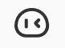
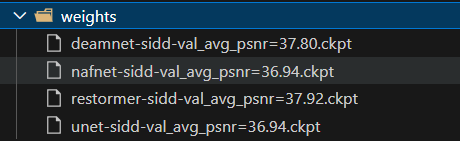
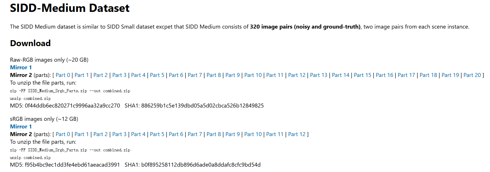

#  AMSNet: Asymmetric Mask Scheme for Self-Supervised Real Image Denoising
This repository is the official implementation of ECCV 2024 "Asymmetric Mask Scheme for Self-Supervised Real Image Denoising"

**[Asymmetric Mask Scheme for Self-Supervised Real Image Denoising](https://arxiv.org/abs/2407.06514)**
</br>
[Xiangyu Liao](https://github.com/lll143653)\*,
Tianheng Zheng,
Jiayu Zhong,
Pingping Zhang,
Chao Ren
<p align="center">
<a href="https://arxiv.org/abs/2407.06514">"></a>

# Environment prepare
## Dependencies

The project depends on the following packages:

- PyTorch
- TorchVision
- OpenCV
- Loguru
- TIMM (PyTorch Image Models)
- PyTorch Lightning
- Weights & Biases (wandb)
- Rich

## Prerequisites

Before you start, make sure you have the following installed:

- Python (3.10, 3.11)
- pip (Python package installer)

## Setup Steps

1. **Create a virtual environment (optional but recommended)**

    ```bash
    conda create -n myenv python=3.10
    conda activate myenv
    ```

2. **Upgrade pip**

    ```bash
    pip install --upgrade pip
    ```

3. **Install the dependencies**

    ```bash
    pip install torch torchvision opencv-python loguru timm pytorch-lightning wandb rich
    ```

## Additional Notes

- **PyTorch Installation**: Depending on your system's configuration, you might want to install PyTorch with specific CUDA versions. Check the [PyTorch official website](https://pytorch.org/get-started/locally/) for more details.

- **OpenCV Installation**: If you need specific OpenCV modules or face issues, refer to the [OpenCV installation guide](https://docs.opencv.org/master/d2/de6/tutorial_py_setup_in_ubuntu.html).

- **Weights & Biases Configuration**: For using Weights & Biases (wandb), you might need to login to your account. Run `wandb login` and follow the instructions.

By following the above steps, you should have your environment set up and ready for development. If you encounter any issues, refer to the documentation of each package or seek help from the community.
# Downloading Pretrained Weights

1. **Download Pretrained Weights:**
   - Navigate to [this link](https://drive.google.com/drive/folders/1Qfz8cbB9jHcTzAAQEpPn7gvSkuiNnovN?usp=sharing) to access the pretrained weights.
   
2. **Save to `weights` Directory:**
   - Once downloaded, place the pretrained weights into the `weights` directory of your project like this
   
   .

# Dataset prepare

## Downloading the SIDD Medium Dataset for train

1. **Download the SIDD Medium Dataset**

    - Visit the [SIDD Medium Dataset](https://abdokamel.github.io/sidd/) website.
    - Follow the instructions on the website to download the dataset.

2. **Extract the Dataset**

    Once the download is complete, extract the contents of the dataset to a directory of your choice. For example:

    ```bash
    zip -FF SIDD_Medium_Srgb_Parts.zip --out combined.zip
    unzip combined.zip  
    ```
## Downloading the SIDD Validation Dataset for validation

To evaluate your models, you need to download the SIDD Validation dataset.

1. **Download the Validation Files**

    - Visit the [SIDD Dataset](https://abdokamel.github.io/sidd/) page.
    - Download the following files:
        - `ValidationGtBlocksSrgb.mat`
        - `ValidationNoisyBlocksSrgb.mat`

2. **Organize the Validation Files**

    Place the downloaded files in a folder. The folder structure should be as follows:

    ```
    datasets/
    └── SIDD_Validation/
        ├── ValidationGtBlocksSrgb.mat
        ├── ValidationNoisyBlocksSrgb.mat
    ```


## Using Your Own Noisy Images

If you do not want to use the SIDD Medium dataset, you can prepare your own noisy images.

1. **Organize Your Noisy Images**

    Place your noisy images in a folder. The folder structure should be as follows:

    ```
    datasets/
    └── custom_noisy_images/
        ├── image1.png
        ├── image2.png
        ├── ...
    ```

2. **Verify the Images**

    Ensure that your images are in a readable format (e.g., PNG, JPEG) and that they are accessible from your script or notebook.

## Converting train Data to LMDB

To facilitate fast reading, you can convert your dataset into an LMDB format using the `divide_sub_image.py` script.

### Example Command

```bash
python divide_sub_image.py --hw 512 512 --lmdb --suffix .PNG .bmp --path <Noisy PATH> --re "NOISY" --name <your_dataset_name> --output <your_output_path> --size 40 --step 256 256
```

### **Verify the lmdb file**

    The lmdb folder structure should be as follows:
    ```
    datasets/
    └── lmdb_folder/
        ├── data.mdb
        ├── lock.mdb
        ├── medium_keys.txt
        ├── meta_info.pkl
        └── meta_info.txt
    ```
# Train

## modify the config file


To train the denoise model, you need to modify the paths in the configuration file. Open the `configs/train/sidd/restormer.yaml` file and update the paths as follows:

```yaml
train:
  type: UnpairDataset
  dataset:
    path: `/mnt/f/datasets/SIDD/lmdb/medium_512_512_lmdb`  # Update this path
    datatype: lmdb # Update this type to "image" if your data is images
    max_len: 10000000
    crop_size: 160
    augment: True
  dataloader:
    batch_size: 4
    shuffle: true
    num_workers: 6
val:
  type: SIDD_validation
  dataset:
    sidd_val_dir: `/mnt/f/datasets/SIDD`  # Update this path
    len: 5
  dataloader:
    batch_size: 1
    shuffle: False
    num_workers: 6
```
more detail in codes/datasets

## train the model

just run the command:

```bash
python DNE2E.py --train --config ./configs/train/sidd/restormer.yaml  
```

# Validation

## modify the config file
To validate the denoise model, you need to modify the paths in the configuration file. Open the `configs/val/sidd/restormer.yaml` file and update the paths as follows:

```yaml
test:
  type: SIDD_validation
  dataset:
    sidd_val_dir: /mnt/f/datasets/SIDD # Update this path
    len: 1280
  dataloader:
    batch_size: 1
    shuffle: False
    num_workers: 6
```
more detail in codes/datasets

## denoise

just run the command:

```bash
python DNE2E.py --config ./configs/val/sidd/restormer.yaml  
```

# Citation

If you find this code useful for your research, please consider citing:
```bibtex
@inproceedings{hu2024gaussianavatar,
        title={Asymmetric Mask Scheme for Self-Supervised Real Image Denoising},
        author={Xiangyu Liao, Tianheng Zheng, Jiayu Zhong, Pingping Zhang, and Chao Ren},
        booktitle={European Conference on Computer Vision (ECCV)},
        year={2024}
}
```

## Acknowledgements

This project is built on source codes shared by [AP-BSN](https://github.com/wooseoklee4/AP-BSN), [SpatiallyAdaptiveSSID](https://github.com/nagejacob/SpatiallyAdaptiveSSID), [CVF-SID](https://github.com/Reyhanehne/CVF-SID_PyTorch), [DeamNet](https://github.com/chaoren88/DeamNet), [Restormer](https://github.com/swz30/Restormer), [NAFNet](https://github.com/megvii-research/NAFNet), [SCPGabNet](https://github.com/linxin0/SCPGabNet), [timm](https://github.com/huggingface/pytorch-image-models) and [pytorch](https://github.com/pytorch/pytorch).
